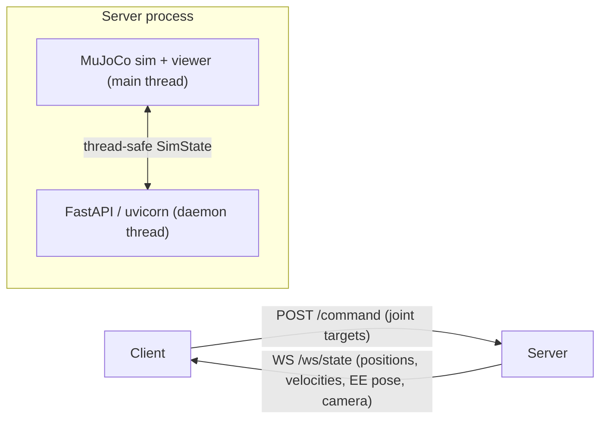

# Dual UR5e MuJoCo Server & Client

Two-way communication layer for the dual-UR5e MuJoCo scene. The **server** runs the
simulation (and an optional viewer window) and exposes a FastAPI app; **clients** send
joint commands over REST and receive streamed state (joint positions, velocities,
end-effector poses, optional camera frames) over a WebSocket.

- Server / visualizer: [mujoco_dual_ur5e_server.py](../mujoco_dual_ur5e_server.py)
- Demo client: [mujoco_dual_ur5e_client.py](../mujoco_dual_ur5e_client.py)
- Scene source it is based on: [mujoco_dual_ur5e.py](../mujoco_dual_ur5e.py)

---

## Architecture



- The MuJoCo simulation and passive viewer run on the **main thread**.
- FastAPI (served by uvicorn) runs in a **background daemon thread**.
- A lock-guarded `SimState` object bridges them: commands flow in, state snapshots flow out.
- Two control modes (see [Physics vs. kinematic](#physics-vs-kinematic)):
  - **Kinematic** (default): commands set joint positions directly and the sim calls
    `mj_forward`. Velocities are reported via finite-difference of joint positions.
  - **Physics** (`--physics`): commands drive the UR5e **position actuators** and the sim
    integrates dynamics with `mj_step` (gravity, inertia, contacts). Velocities come from
    `data.qvel`.

The two robots are named **`left`** and **`right`**. Each has **6 joints** (UR5e):
`shoulder_pan`, `shoulder_lift`, `elbow`, `wrist_1`, `wrist_2`, `wrist_3` — all in **radians**.

---

## Requirements

Install into your Python environment (the project uses the conda env at `d:\coding\envs\pink`):

```pwsh
conda activate d:\coding\envs\pink
pip install fastapi "uvicorn[standard]" httpx websockets pillow
```

`mujoco`, `numpy`, `robot_descriptions`, and `loop_rate_limiters` are already required by the
base scene script.

---

## Running the server

```pwsh
conda activate d:\coding\envs\pink

# Windowed viewer (default), API on http://127.0.0.1:8000
python mujoco_dual_ur5e_server.py

# Headless (no viewer window)
python mujoco_dual_ur5e_server.py --headless

# Enable offscreen camera rendering at startup
python mujoco_dual_ur5e_server.py --camera

# Enable full dynamics (gravity, inertia, contacts) via mj_step
python mujoco_dual_ur5e_server.py --physics

# Custom bind address / port
python mujoco_dual_ur5e_server.py --host 0.0.0.0 --port 8123
```

| Flag         | Default     | Description                                       |
| ------------ | ----------- | ------------------------------------------------- |
| `--headless` | off         | Run the simulation without the viewer window.     |
| `--camera`   | off         | Turn on offscreen camera rendering at startup.    |
| `--physics`  | off         | Integrate dynamics with `mj_step` (see below).    |
| `--host`     | `127.0.0.1` | FastAPI bind host.                                |
| `--port`     | `8000`      | FastAPI bind port.                                |

Interactive API docs are available at `http://<host>:<port>/docs` while the server runs.

---

## Physics vs. kinematic

The same REST/WebSocket interface works in both modes; only the underlying simulation differs.

| Aspect          | Kinematic (default)                     | Physics (`--physics`)                          |
| --------------- | --------------------------------------- | ---------------------------------------------- |
| Integrator      | `mj_forward` (forward kinematics only)  | `mj_step` (full dynamics)                      |
| Command effect  | Sets `qpos` directly (instant teleport) | Sets position-actuator targets (`ctrl`)        |
| Motion          | Snaps to target immediately             | Accelerates, overshoots/settles, obeys limits  |
| Gravity/contact | Ignored                                 | Applied                                        |
| `velocities`    | Finite-difference of `qpos` (~0 at rest)| True `qvel` from the integrator                |
| `/home`         | Teleports to home pose                  | Teleports to home + targets actuators there    |

Notes for physics mode:

- Commands are **actuator targets**, so the arm takes time to converge and may sag slightly
  under gravity at rest (position actuators have finite stiffness).
- The loop runs at 200 Hz and sub-steps the 0.002 s physics timestep to stay near real time.
- Joint targets are clamped to each actuator's control range.

Send joint **position targets** (6 values, radians) for `left` and/or `right`. The robot snaps
to the commanded configuration on the next sim tick.

### Move one robot — `POST /command`

Body:

```json
{ "robot": "left", "positions": [0.5, -1.5708, 1.5708, -1.5708, -1.5708, 0.0] }
```

```pwsh
# PowerShell (Windows)
$body = '{"robot":"left","positions":[0.5,-1.5708,1.5708,-1.5708,-1.5708,0.0]}'
Invoke-RestMethod -Method Post -Uri http://127.0.0.1:8000/command `
  -ContentType application/json -Body $body
```

```bash
# curl
curl -X POST http://127.0.0.1:8000/command \
  -H "Content-Type: application/json" \
  -d '{"robot":"left","positions":[0.5,-1.5708,1.5708,-1.5708,-1.5708,0.0]}'
```

### Move both robots — `POST /command/batch`

Provide `left`, `right`, or both. Omitted robots are left unchanged.

```json
{
  "left":  [0.5, -1.5708, 1.5708, -1.5708, -1.5708, 0.0],
  "right": [-0.5, -1.5708, 1.5708, -1.5708, -1.5708, 0.0]
}
```

### Return to the home pose — `POST /home`

Resets both robots to `HOME_QPOS` = `[-1.5708, -1.5708, 1.5708, -1.5708, -1.5708, 0.0]`.

```pwsh
Invoke-RestMethod -Method Post -Uri http://127.0.0.1:8000/home
```

### From Python (`httpx`)

```python
import httpx

base = "http://127.0.0.1:8000"
home = [-1.5708, -1.5708, 1.5708, -1.5708, -1.5708, 0.0]

# Move just the left robot's base joint.
left = home.copy()
left[0] = 0.5
httpx.post(f"{base}/command", json={"robot": "left", "positions": left})

# Move both at once.
right = home.copy()
right[0] = -0.5
httpx.post(f"{base}/command/batch", json={"left": left, "right": right})

# Reset.
httpx.post(f"{base}/home")
```

---

## How to get data

### One-shot snapshot — `GET /state`

```pwsh
Invoke-RestMethod -Uri http://127.0.0.1:8000/state | ConvertTo-Json -Depth 5
```

```python
import httpx
state = httpx.get("http://127.0.0.1:8000/state").json()
print(state["robots"]["left"]["positions"])
```

### Continuous stream — WebSocket `GET /ws/state`

The server pushes a snapshot at ~60 Hz. If the camera is enabled, each message also carries a
base64-encoded JPEG under `camera_jpeg_base64`.

```python
import asyncio, json, websockets

async def listen():
    async with websockets.connect("ws://127.0.0.1:8000/ws/state") as ws:
        while True:
            msg = json.loads(await ws.recv())
            left = msg["robots"]["left"]
            print("left q:", left["positions"], "v:", left["velocities"])

asyncio.run(listen())
```

### Snapshot schema

```json
{
  "time": 1718560000.123,
  "robots": {
    "left": {
      "positions":  [q0, q1, q2, q3, q4, q5],     // joint angles (rad)
      "velocities": [v0, v1, v2, v3, v4, v5],     // finite-diff joint velocity (rad/s)
      "ee_position": [x, y, z],                    // end-effector position (m, world frame)
      "ee_xmat": [r00, r01, r02, r10, r11, r12, r20, r21, r22]  // EE rotation, row-major 3x3
    },
    "right": { "...": "same shape as left" }
  },
  "camera_jpeg_base64": "<present only when camera enabled>"
}
```

| Field         | Units / shape         | Notes                                                 |
| ------------- | --------------------- | ----------------------------------------------------- |
| `time`        | seconds (epoch)       | Wall-clock time the snapshot was published.           |
| `positions`   | rad, length 6         | Current joint angles.                                 |
| `velocities`  | rad/s, length 6       | Finite-diff in kinematic mode; true `qvel` in physics.|
| `ee_position` | m, length 3           | End-effector site position in world coordinates.      |
| `ee_xmat`     | length 9 (row-major)  | End-effector rotation matrix; reshape to 3×3.         |

Reconstruct the rotation matrix in NumPy:

```python
import numpy as np
R = np.array(state["robots"]["left"]["ee_xmat"]).reshape(3, 3)
```

---

## Camera frames (optional)

Camera rendering is **off by default** (it renders offscreen and adds load). Enable it at
startup with `--camera`, or toggle it at runtime:

```pwsh
# Enable
Invoke-RestMethod -Method Post -Uri http://127.0.0.1:8000/camera `
  -ContentType application/json -Body '{"enabled":true}'

# Grab a single frame (base64 JPEG); 404 if camera is disabled
Invoke-RestMethod -Uri http://127.0.0.1:8000/camera/frame
```

Decode a frame in Python:

```python
import base64, httpx
resp = httpx.get("http://127.0.0.1:8000/camera/frame").json()
with open("frame.jpg", "wb") as f:
    f.write(base64.b64decode(resp["jpeg_base64"]))
```

When enabled, frames are also embedded in the `/ws/state` stream as `camera_jpeg_base64`.
Default resolution is 640×480 at JPEG quality 60 (see the constants in
[mujoco_dual_ur5e_server.py](../mujoco_dual_ur5e_server.py)).

---

## Demo client

[mujoco_dual_ur5e_client.py](../mujoco_dual_ur5e_client.py) drives both robots with
out-of-phase sinusoids while printing the streamed state, then returns them home on exit.

```pwsh
conda activate d:\coding\envs\pink

# Run against the default server
python mujoco_dual_ur5e_client.py

# Custom target, duration, and save the first camera frame
python mujoco_dual_ur5e_client.py --host 127.0.0.1 --port 8123 --duration 10 --camera
```

| Flag         | Default     | Description                                         |
| ------------ | ----------- | --------------------------------------------------- |
| `--host`     | `127.0.0.1` | Server host.                                        |
| `--port`     | `8000`      | Server port.                                        |
| `--duration` | `15`        | Seconds to run the sinusoidal demo.                 |
| `--camera`   | off         | Enable camera streaming and save the first frame.   |

---

## API reference

| Method | Path             | Body                                  | Purpose                                  |
| ------ | ---------------- | ------------------------------------- | ---------------------------------------- |
| `GET`  | `/state`         | —                                     | Latest state snapshot (JSON).            |
| `POST` | `/command`       | `{robot, positions[6]}`               | Set one robot's joint targets.           |
| `POST` | `/command/batch` | `{left?[6], right?[6]}`               | Set both robots' joint targets.          |
| `POST` | `/home`          | —                                     | Reset both robots to the home pose.      |
| `POST` | `/camera`        | `{enabled: bool}`                     | Toggle offscreen camera rendering.       |
| `GET`  | `/camera/frame`  | —                                     | Latest JPEG (base64); 404 if disabled.   |
| `WS`   | `/ws/state`      | —                                     | Stream snapshots (~60 Hz).               |

### Error responses

| Status | When                                                                 |
| ------ | -------------------------------------------------------------------- |
| `422`  | Unknown robot name, wrong number of joint values, or empty batch.    |
| `404`  | `/camera/frame` requested while the camera is disabled / no frame.   |

---

## Notes & limitations

- **Two modes.** Kinematic (default) sets joint positions directly via `mj_forward`; physics
  (`--physics`) integrates dynamics via `mj_step` and drives position actuators. See
  [Physics vs. kinematic](#physics-vs-kinematic).
- **Velocities.** In kinematic mode they are finite-differences (read ~0 while holding a
  pose); in physics mode they are the integrator's `qvel`.
- **Single viewer thread.** The viewer must run on the main thread; the API runs in a daemon
  thread. Closing the viewer window stops the server.
- **Camera cost.** Offscreen rendering requires a working GL backend and adds per-tick load;
  leave it off unless you need frames.
